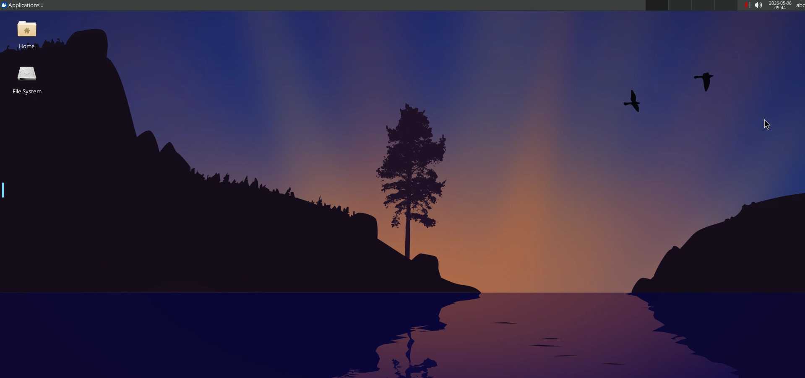
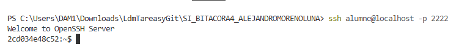
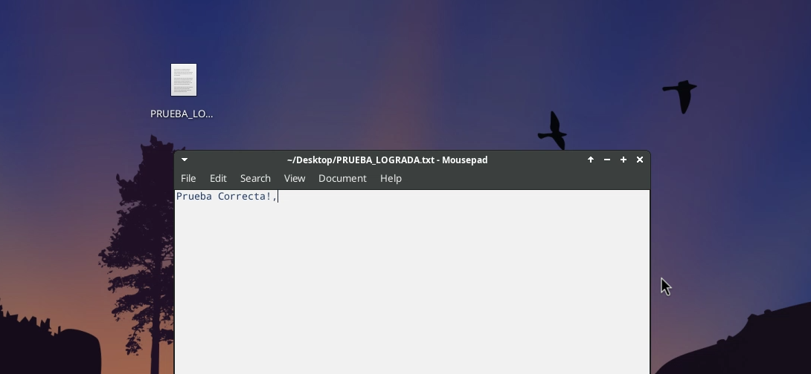

# SI_BITACORA4_ALEJANDROMORENOLUNA
Este es el desarrollo paso a paso de mi tarea SI BITACORA 4 de la asignatura Sistemas Informáticos.

**FASE NUMERO 1º**
    En esta fase, en primer lugar crearemos el archivo dockr-compose.yml para poder descargar nuestro sistema operativo.
    hacemos un docker-compose up -d para descargarlo y abrir nuestro contenedor.
    tras haber realizado esos pasos, y confirmado todo con docker ps en mi navegador he buscado localhost:3000 para abrir el nuevo sistema operativo:
    

**FASE NUMERO 3º**
    3.1
        Para empezar esta fase me he conectado al contenedor usar shh
        Posteriormente, tras poner mi contraseña ahora vamos a salirnos para comprobar que nos podemos conectar al servidor sin contraseña creado la llave.
    3.2
        nos salimos y lo iniciamos sin contraseña
        
        Comprobamos que he conseguid hacer el txt
        

Errores:
    No consigo que me funcione la implementación de la primera foto del escritorio. Por eso, no me ha dado tiempo a continuar no he conseguido solucionarlo. De todos modos, tiene la foto en la carpeta.
        
ACTUALIZACIÓN: Willman, son y 27 pero he conseguido solucionar el problema de que no me dejaba añadir la imagen. Lo he conseguido quitando el texto y volviendolo a poner porque github creia que eso era un documento txt.